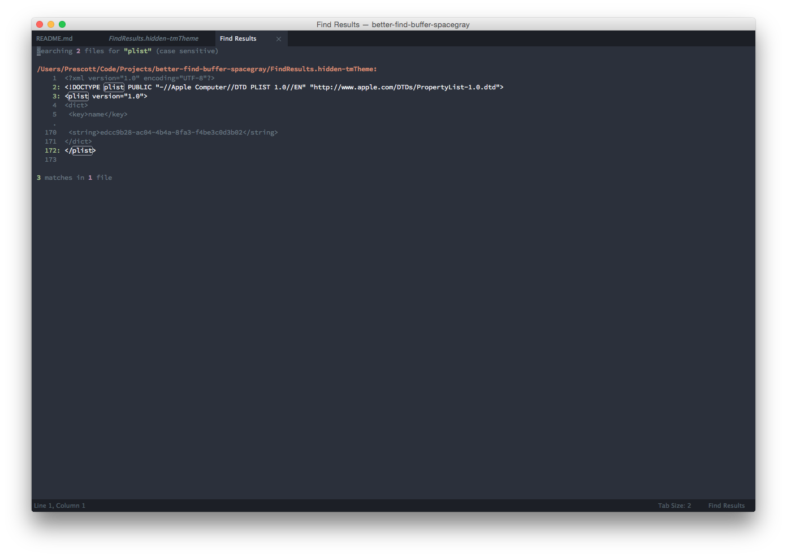

# BetterFindBuffer Spacegray
A Base 16 (Ocean) color scheme to make the awesome [BetterFindBuffer](https://github.com/aziz/BetterFindBuffer)
a little easier on the eyes.
Looks great with/inspired by [Spacegray](https://github.com/kkga/spacegray).
This is just a rough cut. If you make some improvements, let me know!
## Usage
- Get [BetterFindBuffer](https://github.com/aziz/BetterFindBuffer).
- There are open issues on BetterFindBuffer complaining of difficulty using
custom themes by copying them to the User folder and editing the preferences as described in the project's readme. If you
experience similar problems, simply choose Preferences > Browse Packages in ST3 and overwrite
FindResults.hidden-tmTheme with the version from this repo. (Backup the original.)

## Screenshot
Looks like this: 
